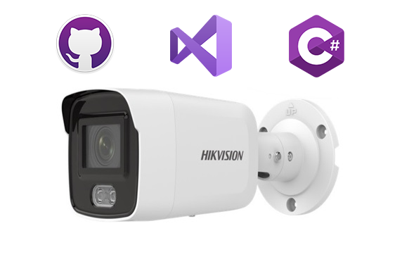

# CHCNetSDK-Example

Đây là project minh họa cách sử dụng **CHCNetSDK** (Hikvision Network SDK) để tích hợp vào ứng dụng C# (.NET Framework 4.7.2). 

Trong ví dụ này có một số chức năng cơ bản để kết nối camera, xem trực tiếp (live view), điều khiển PTZ và chỉnh màu sắc của camera/đầu ghi hình (DVR/NVR/IPC) của Hikvision. Còn nhiều chức năng khác trong file **CHCNetSDK\CHCNetSDK.cs**

## 1. Cài đặt công cụ cần thiết để build

### Yêu cầu môi trường

- **Visual Studio 2022** (hoặc mới hơn) với workload **.NET desktop development**.
- **.NET Framework 4.7.2** Developer Pack (thường đã có sẵn trong Visual Studio, nếu thiếu cài qua **Visual Studio Installer > Individual components**).
- Hệ điều hành **Windows** (SDK của Hikvision chỉ hỗ trợ Windows, chạy dưới dạng thư viện native `.dll`).

### Các bước build

1. Clone repository:
2. Mở file solution (`.sln`) bằng Visual Studio 2022.
3. Project này chỉ có mode x64
4. Nhấn **F5** hoặc **Ctrl+Shift+B** để build và chạy chương trình (`__Build > Build Solution__`).
5. Chương trình sẽ build chương trình vào folder **bin**

## 3.  Kiến trúc (Platform target)

- Tất cả các file dll cần thiết đã copy sẵn vào folder **bin**
- `lib/TGMTcs/` — Thư viện tiện ích dùng chung (đọc/ghi file `.ini`, các hàm tiện ích, form control, âm thanh...) của công ty Thị giác Máy tính
- Một số controls trong giao diện chương trình được tích hợp sẵn trong file TGMTcontrols.dll

## 👤 Tác giả

https://thigiacmaytinh.com