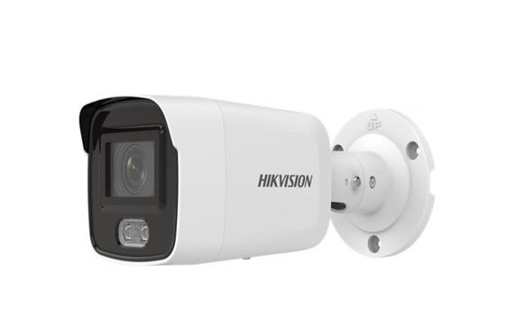

# CHCNetSDK-Example

Dự án mẫu (example) minh họa cách sử dụng **CHCNetSDK** (Hikvision Network SDK) trong ứng dụng C# (.NET Framework 4.7.2) để kết nối, xem trực tiếp (live view), điều khiển PTZ và tương tác với các thiết bị camera/đầu ghi hình (DVR/NVR/IPC) của Hikvision.

## 1. Mục tiêu của project

- Cung cấp ví dụ tích hợp **CHCNetSDK** vào ứng dụng Windows Forms bằng C#.
- Hướng dẫn cách:
  - Khởi tạo SDK (`NET_DVR_Init`).
  - Đăng nhập/đăng xuất thiết bị (`NET_DVR_Login_V30`, `NET_DVR_Logout`).
  - Xem hình ảnh trực tiếp (real-time preview) từ camera.
  - Xử lý dữ liệu hình ảnh trả về qua callback (`REALDATACALLBACK`).
  - Ghi log lỗi SDK để debug (`NET_DVR_SetLogToFile`, `NET_DVR_GetLastError`).
- Làm tài liệu tham khảo nhanh cho các dự án khác cần tích hợp camera Hikvision mà không cần đọc toàn bộ tài liệu SDK gốc (vốn khá phức tạp và chủ yếu bằng tiếng Trung/Anh).

## 2. Cài đặt công cụ cần thiết để build

### Yêu cầu môi trường

- **Visual Studio 2022** (hoặc mới hơn) với workload **.NET desktop development**.
- **.NET Framework 4.7.2** Developer Pack (thường đã có sẵn trong Visual Studio, nếu thiếu cài qua **Visual Studio Installer > Individual components**).
- Hệ điều hành **Windows** (SDK của Hikvision chỉ hỗ trợ Windows, chạy dưới dạng thư viện native `.dll`).

### Các bước build

1. Clone repository:
2. Mở file solution (`.sln`) bằng Visual Studio 2022.
3. Kiểm tra cấu hình build (**Platform**) phải khớp với kiến trúc của các file `.dll` SDK đikèm (thường là **x86**, vì CHCNetSDK truyền thống chỉ phát hành bản 32-bit). Vào **Project > Properties > Build**, đặt **Platform target** = `x86`.
4. Restore NuGet packages (nếu có) qua **Tools > NuGet Package Manager > Restore Packages** hoặc build trực tiếp, Visual Studio sẽ tự restore.
5. Nhấn **F5** hoặc **Ctrl+Shift+B** để build và chạy chương trình (`__Build > Build Solution__`).
6. Đảm bảo thư mục output (`bin\Debug` hoặc `bin\x86\Debug`) chứa đầy đủ các file `.dll` native của SDK (xem mục 3 bên dưới) — nếu thiếu, chương trình sẽ báo lỗi `DllNotFoundException` khi chạy.

## 3. Những điều cần lưu ý khi tích hợp CHCNetSDK vào project khác

### a. Kiến trúc (Platform target)

- CHCNetSDK của Hikvision cung cấp các file `.dll` native (C/C++) theo kiến trúc **x86** hoặc **x64** riêng biệt. Project C# phải build đúng **Platform target** khớp với bộ `.dll` đang sử dụng (không dùng **Any CPU** vì dễ gây lỗi `BadImageFormatException`).
- Nếu dùng bộ SDK x86, tất cả file `.dll` phụ trợ (`HCNetSDK.dll`, `HCCore.dll`, `PlayCtrl.dll`, `StreamTransClient.dll`, `SuperRender.dll`, v.v.) và các thư mục con như `HCNetSDKCom`, `PlayCtrl` cần được copy đầy đủ vào thư mục output cùng cấp với file `.exe`.

### b. Copy các file DLL bắt buộc

- Không chỉ copy `HCNetSDK.dll`, mà cần copy **toàn bộ thư mục SDK gốc** đi kèm (bao gồm các thư mục `HCNetSDKCom`, `PlayCtrl`, `Language`,...) vì SDK sẽ tự động load thêm nhiều module con lúc runtime.
- Đặt thuộc tính **Copy to Output Directory** = `Copy if newer` cho các file `.dll` này trong project (`Properties > Copy to Output Directory`), hoặc dùng post-build event để copy tự động.

### c. Khởi tạo và giải phóng SDK đúng cách

- Luôn gọi `CHCNetSDK.NET_DVR_Init()` một lần khi ứng dụng khởi động (ví dụ trong `FormMain_Load`),và gọi `NET_DVR_Cleanup()` khi ứng dụng đóng để giải phóng tài nguyên native.
- Nên bật ghi log SDK bằng `NET_DVR_SetLogToFile(3, "C:\\SdkLog\\", true)` để dễ dàng debug khi có lỗi xảy ra ở tầng nativemà không có exception rõ ràng ở tầng C#.

### d. Xử lý lỗi

- Hầu hết các hàm SDK trả về `bool`/giá trị âm khi thất bại.Luôn kiểm tra kết quả và gọi `NET_DVR_GetLastError()` để lấy mã lỗi cụ thể, giúp xác định nguyên nhân (sai IP/port, sai tài khoản, thiết bị offline, v.v.).

### e. Callback và luồng dữ liệu

- Các callback như `REALDATACALLBACK` được gọi từ native code trên một luồng khác với UI thread. Khi cần cập nhật giao diện (ví dụ `PictureBox` hiển thị hình ảnh) từtrong callback, phải dùng `Invoke`/`BeginInvoke` để tránh lỗi truy cập chéo luồng (`cross-thread operation`).
- Giữ tham chiếu(delegate) của callback (như biến `RealData` trong `FormMain`) còn sống trong suốt thời gian sử dụng, nếu không GC có thể thu hồi delegate và gây crash khi native code gọi lại vào mộtcon trỏ đã bị giải phóng.

### f. Quản lý handle/tài nguyên

- Luôn lưu và kiểm tra `m_lUserID` (kết quả đăng nhập) và `m_lRealHandle` (handle luồng xem trực tiếp). Khi dừng xem hoặc đăng xuất, phải gọi đúng thứ tự: dừng preview (`NET_DVR_StopRealPlay`) trước, sau đó mới `NET_DVR_Logout`, tránh rò rỉ tài nguyên hoặc treo kết nối phía thiết bị.

### g. Tương thích thiết bị

- Một số hàm SDK có nhiều phiên bản (ví dụ `NET_DVR_Login_V30`, `NET_DVR_Login_V40`) tùy theo dòng thiết bị và firmware. Khi tích hợp vào project mới, nên kiểm tra tài liệu SDK tương ứng với model thiết bị thực tế đang sử dụng để chọn đúng hàm.

### h. Bảo mật thông tin đăng nhập

- Không hard-code IP, tài khoản, mật khẩu thiết bị trong code. Project này lưu mật khẩu qua `TGMTini` (file cấu hình `.ini`) — khi áp dụng cho môi trường production, nên cân nhắc mã hóa thông tin nhạy cảm này.

## 4. Cấu trúc thư mục chính

- `CameraController/` — Ứng dụng WinForms mẫu chính, chứa `FormMain.cs` (giao diện, xử lý đăng nhập, xem trực tiếp) và `HCNetWrapper.cs` (wrapper gọi các hàm SDK).
- `lib/TGMTcs/` — Thư viện tiện ích dùng chung (đọc/ghi file `.ini`, các hàm tiện ích, form control, âm thanh...).
- `bin/` — Chứa file build output và các thư viện native cần thiết.

